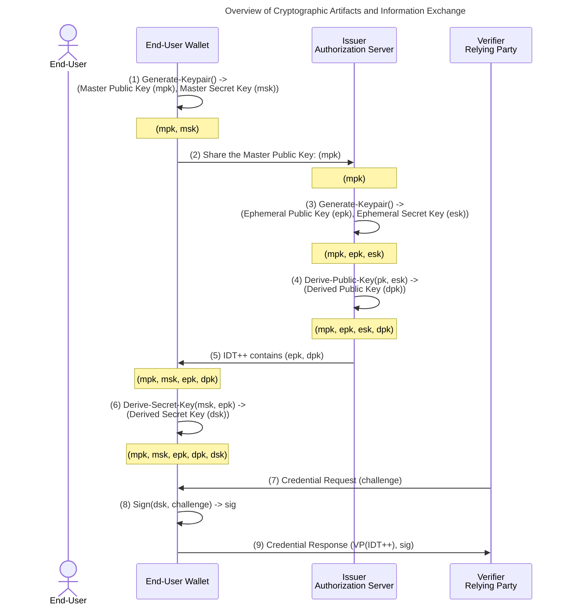

# IDT++ - Asynchronous Proof-of-Possession Key Generation <!-- omit from toc -->

- [Introduction](#introduction)
- [ARKG Overview](#arkg-overview)
- [ARKG Profile for Elliptic Curves](#arkg-profile-for-elliptic-curves)
- [Generate Master Secret and Public Key](#generate-master-secret-and-public-key)
- [Representation of a Master Public Key](#representation-of-a-master-public-key)
  - [Representation of a Master Public Key in a Compact Form](#representation-of-a-master-public-key-in-a-compact-form)
- [Asynchronous Derivation of the Proof-of-Possession Public Key](#asynchronous-derivation-of-the-proof-of-possession-public-key)
  - [Derive Public Key](#derive-public-key)
- [Representation of an ARKG-Derived Asymmetric Proof-of-Possession Key in JWT](#representation-of-an-arkg-derived-asymmetric-proof-of-possession-key-in-jwt)
  - [`cnf`: Confirmation Claim](#cnf-confirmation-claim)
  - [`kdk`: Key Derivation Key](#kdk-key-derivation-key)
  - [Example](#example)
- [Derivation of the Proof-of-Possession Private Key](#derivation-of-the-proof-of-possession-private-key)

In this section we define how an authorisation server can derive a proof-of-possession public key for a user without interacting with the user's wallet and without being able to derive or learn anything about the corresponding secret key.

## Introduction

[Proof-of-Possession Key Semantics for JSON Web Tokens (JWTs)](https://datatracker.ietf.org/doc/html/rfc7800) defines how to declare in a JWT that the presenter possesses a specific proof-of-possession key. This feature is crucial when sharing credentials through digital wallets. A typical credential issuance flow consists of three key phases:

- **Wallet Authorization**: The user authorizes their wallet to request credentials on their behalf.
- **Proof of Possession**: The wallet proves possession of a secret key to the issuer’s server so that issuer can add it to the credential.
- **Credential Retrieval**: The wallet fetches the credential from the issuer’s server.

The Wallet authorization phase is a one-time step, analogous to (dynamic) client registration. However, the proof-of-possession phase, which includes several interactions between a server and a wallet, must be repeated for each credential if each credential needs to be bound to a unique public key.

Here’s how the proof-of-possession process typically works:

- The issuer's server challenges the wallet to prove possession of a key through a challenge-response mechanism.
- The wallet signs the challenge, generating a cryptographic proof, and sends it back to the server.
- The server verifies the proof.
- The server includes a `cnf` claim in the payload, confirming the wallet's possession of the key.
- The server signs the credential.
- The wallet fetches the credential from the server.

While the first and third phases can be mapped to OIDC processes, Dynamic Client Registration and OIDC code flow, respectively, the second phase poses two main challenges. First, injecting a proof-of-possession verification into the /token endpoint requires significant changes to existing OIDC Authorization Servers, second, wallet must communicate with the server and send a proof for every credential it requests. What if wallet could register with the server only once, and from that point on, server could deliver the issued credential to a wallet as any other file, while supporting the binding to a public key?

To address this, we are using the Asynchronous Remote Key Generation (ARKG). ARKG allows us to delegate the public key generation to an authorization server without requiring access to the secret keys or interaction with the wallet. This method ensures that users retain full control of their secret keys while removing the need for direct interaction between authorization servers and digital wallets.

For example, when Alice registers with an issuer, she provides her master public key. The issuer can derive multiple public keys for Alice without further communication with her wallet. Only Alice can generate the corresponding secret keys, ensuring her exclusive control. The issuer can then issue credentials and share them with Alice through any communication channel.

ARKG offers several key advantages:

- Minimal interaction between the wallet and issuer, reducing communication overhead.
- Issuers can issue credentials without directly contacting the wallet.
- VCs can be deposited into the wallet using various communication methods, such as email or messaging services.
- ARKG allows the introduction of a credential servers (REST endpoints), decoupled from the Authorization Server, that can serve the wallet credentials in different formats.
- It enables us to introduce JWT-friendly selective disclosure, [SD-Cha-Cha](./02_sd-cha-cha.md), which allows users to share specific claims while keeping others private.

## ARKG Overview

The ARKG algorithm involves several cryptographic artifacts, including public (pk) and secret (sk) keys. The table below outlines which cryptographic artifacts are generated by each element (wallet or issuer server) and identifies how and with whom these artifacts are shared.

| Cryptographic Artifact | Short |      Wallet      |      Issuer      |     Verifier     |
| ---------------------- | :---: | :--------------: | :--------------: | :--------------: |
| Master Public Key      |  mpk  |    Generated     | Shared by Wallet |                  |
| Master Secret Key      |  msk  |    Generated     |                  |                  |
| Ephemeral Public Key   |  epk  | Shared by Issuer |    Generated     |                  |
| Ephemeral Secret Key   |  esk  |                  |    Generated     |                  |
| Derived Public Key     |  dpk  |     Derived      |     Derived      | Shared by Wallet |
| Derived Secret Key     |  dsk  |     Derived      |                  |                  |

The ARKG algorithm defines three main functions:

**Generate-Keypair() -> (pk, sk)**: This function generates a public (mpk) and secret (msk) keypair. It is used to generate both master and ephemeral keypairs.

**Derive-Public-Key(mpk) -> (dpk, epk)**: This function takes a master public key (mpk) as input and derives a new derived public key (dpk) along with the corresponding ephemeral public key (epk). Only the owner of the master secret key (msk) can derive the corresponding secret key (dsk).

**Derive-Secret-Key(msk, epk) -> (dsk)**: This function derives the derived secret key (dsk) using the master secret key (msk) and the ephemeral public key (epk).

The diagram below summarizes when each cryptographic artifact is generated and when it is shared.



**(1)** An End-User uses her wallet and generates a master secret key (msk) and a master public key (mpk).  
**(2)** The End-User shares their master public key with the Issuer.  
**(3)** The Issuer generates an ephemeral key pair (epk, esk).  
**(4)** The Issuer derives a public key (dpk) from the master public key.  
**(5)** The Issuer shares the derived public key with the wallet (as part of the IDT++).  
**(6)** The wallet derives the corresponding derived secret key (dsk) for the derived public key.  
**(7)** The Verifier requests a credential.  
**(8)** The wallet signs the challenge using the derived secret key.  
**(9)** The wallet sends a credential response to the Verifier.  

The issuer can create a new public key for the user by only knowing the user's master public key. This means that once the issuer has the user's master public key, it can generate and link new credentials to the user’s public keys without needing to interact with the user's wallet. These credentials can then be shared with the user and their wallet just like any other file, using various communication methods, such as email.

## ARKG Profile for Elliptic Curves

ARKG utilizes two primary cryptographic operations for deriving public and secret keys:

**Key Encapsulation Mechanism (KEM)**: A public-key cryptosystem that allows a sender to generate a short secret key and transmit it to a receiver securely, in spite of eavesdropping and intercepting adversaries. In ARKG with Elliptic Curves, Elliptic Curve Diffie-Hellman (ECDH) function is used.  

**Key Blinding (BL)**: A process by which a private signing key or public verification key is blinded (randomized) to hide information about the key pair. In ARKG with Elliptic Curves, public key addition is used as Key Blinding.

The following ARKG instantiation parameters are defined in this specification:

- **KEM**: Elliptic Curve Diffie-Hellman (ECDH)
- **BL**: Public Key Addition
- **Elliptic Curves**: P256, P256k, P384, P521

The supported ARKG instantiations are as follows:

- **ARKG-P256ADD-ECDH-single** – REQUIRED to support
- **ARKG-P521ADD-ECDH-single** – RECOMMENDED to support
- **ARKG-P256kADD-ECDH-single** – OPTIONAL to support
- **ARKG-P384ADD-ECDH-single** – OPTIONAL to support

## Generate Master Secret and Public Key

The Master Secret Key is an elliptic curve (EC) secret key that MUST be securely generated by the End-User, for example, using their digital wallet. Since current Hardware Security Modules (HSMs) do not support the elliptic curve arithmetic required for ARKG, the secret keys MUST be protected in software. The master public key is derived from the master secret key.

Recommended Security Profiles

- **NIST**: Security profiles in standards like SP 800-53 (general security and privacy controls) and SP 800-57 (key management).
- **ETSI**: Security profiles in standards, ETSI EN 319 411-1 and ETSI TS 103 523.

## Representation of a Master Public Key

Master Public Key MUST be represented as [JWK](https://datatracker.ietf.org/doc/html/rfc7517). The JWK MUST contain the required key members for a JWK of that key type and it MUST contain the `kid` JWK member. It MAY contain other JWK members.

### Representation of a Master Public Key in a Compact Form

The compact form of the master public key is defined as a Base64URL-encoded JWK, following the [JWS](https://datatracker.ietf.org/doc/html/rfc7515) specification: `BASE64URL(UTF8(JWKS))`.

This is the default compact representation. In cases where additional size optimization is required, the master public key MUST be represented as outlined in the [ARKG COSE Binding](https://www.ietf.org/archive/id/draft-bradleylundberg-cfrg-arkg-02.html#section-5.1).

## Asynchronous Derivation of the Proof-of-Possession Public Key

### Derive Public Key

The public key derivation algorithm consists of the steps presented in the pseudocode below.

```pseudocode
ARKG-DERIVE-PUBLIC-KEY(mpk) -> (dpk, epk)
  Description:
    This function derives a new public key (dpk) from the master public key (mpk) using the ARKG algorithm.

  Parameters:
    crv: REQUIRED. Elliptic Curve type.

  Input:
    mpk: REQUIRED. Master Public Key.

  Output:
    dpk: Derived Public Key.
    epk: Ephemeral Public Key.

  Process:
  (1) [Generate Ephemeral Key Pair] 
      Generate an ephemeral key pair (epk, esk) using the specified elliptic curve type:
  
      epk, esk <- GENERATE-KEYPAIR(crv)

  (2) [Compute Shared Secret] 
      Compute a shared secret using the Elliptic Curve Diffie-Hellman (ECDH) algorithm.

      shared_secret <- ECDH(esk, mpk)

  (3) [Convert Shared Secret to Scalar]
      Convert the shared secret to a scalar value using a cryptographic hash function, then use this scalar value as a private key to generate a public key:

      shared_secret_scalar <- HASH-TO-SCALAR(shared_secret)
      shared_secret_public_key <- PUBLIC-KEY(secret_key=shared_secret_scalar)

  (4) [Derive the Public Key]
      Derive the final public key by adding the master public key (mpk) and the shared_secret_public_key:

      dpk <- mpk + shared_secret_public_key

  (5) [Serialize Ephemeral Public Key]
      Convert the ephemeral public key to an octet string format:

      epk <- ELLIPTIC-CURVE-POINT-TO-OCTET-STRING(epk)

  (6) [Return Values]
      Return the derived public key (dpk) and the serialized ephemeral public key (epk):

      RETURN (dpk, epk)
```

## Representation of an ARKG-Derived Asymmetric Proof-of-Possession Key in JWT

### `cnf`: Confirmation Claim

IDT++ extends the [Representation of an Asymmetric Proof-of-Possession Key](https://www.rfc-editor.org/rfc/rfc7800.html#section-3.2) as follows:

The JWK member MUST contain the required key members for a JWK of that key type and it MUST contain the `kid` JWK member as defined below. It MAY contain other JWK members. `kid` MUST be computed as
  >
  > `jwk_thumbprint(cnf JWK)`

### `kdk`: Key Derivation Key

The `kdk` JWT claim specifies that the included key MUST be used by the end-user to derive the proof-of-possession key, represented by the `cnf` claim, using the ARKG algorithm. The value of the `kdk` claim is a public key formatted as a JWK (JSON Web Key). The `kdk` MUST contain the required key members for a JWK of that key type and members defined below:

- kid: REQUIRED.
  > MUST be computed as
  >
  > `SHA256(jwk_thumbprint(Master Public Key JWK) || jwk_thumbprint(cnf JWK) || jwk_thumbprint(kdk JWK))`
- alg: REQUIRED. MUST be `ARKG-P256ADD-ECDH`.
- key_use: REQUIRED. MUST be `[arkg_deriveKey]`.

### Example

The following is a non-normative example of the `cnf` and `kdk` claims:

```json
{
  "cnf": {
    "kid": "123abc",
    "key_use": ["verify"],
    "kty": "EC",
    "crv":"P-256",
    "x":"MKBCTNIcKUSDii11ySs3526iDZ8AiTo7Tu6KPAqv7D4", 
    "y":"4Etl6SRW2YiLUrN5vfvVHuhp7x8PxltmWWlbbM4IFyM"
  },
  "kdk": {
    "kid": "abc123",
    "key_use": ["arkg_deriveKey"],
    "alg": "ARKG-P256ADD-ECDH",
    "kty": "EC",
    "crv":"P-256",
    "x":"MKBCTNIcKUSDii11ySs3526iDZ8AiTo7Tu6KPAqv7D4", 
    "y":"4Etl6SRW2YiLUrN5vfvVHuhp7x8PxltmWWlbbM4IFyM"
  }
}
```

## Derivation of the Proof-of-Possession Private Key

Private key derivation algorithm is described below:

```pseudocode
ARKG-DERIVE-PRIVATE-KEY(msk, epk) -> dsk
  Description:
    This function derives a derived secret key (dsk) using the master secret key (msk), the ephemeral public key (epk).

  Parameters:
    crv: REQUIRED. Elliptic Curve type.
    HASH: REQUIRED. Hash function. Default: SHA-256
  
  Input:
    msk: REQUIRED. Master Secret Key (corresponding to the master public key used in ARKG-DERIVE-PUBLIC-KEY).
    epk: REQUIRED. Ephemeral Public Key (obtained from ARKG-DERIVE-PUBLIC-KEY).

  Output:
    dsk: Derived Secret Key.

  Process:
  (1) [Deserialize Master Secret Key]
      Deserialize the master secret key (msk) into a scalar value (sk):

      sk <- DESERIALIZE-TO-SCALAR(msk)

  (2) [Deserialize Ephemeral Public Key]
      Deserialize the ephemeral public key (epk) into a point on the elliptic curve:

      epk_point <- DESERIALIZE-TO-POINT(epk)

  (3) [Compute Blinding Secret]
      Compute the shared secret using ECDH with epk_point and sk:

      shared_secret <- EC-DIFFIE-HELLMAN(epk_point, sk)

  (4) [Hash to Scalar]
    Serialize the shared secret to an EC scalar.

      shared_secret_scalar <- HASH-TO-SCALAR(shared_secret)

  (5) [Derive Derived Secret Key]
      Compute the derived secret key (dsk) by adding the master secret key (msk) and shared_secret. If the result is zero, return an error:

      dsk <- msk + shared_secret_scalar

      IF dsk = ZERO THEN
          RETURN ERROR

  (6) [Return Value]
      Return the derived secret key (dsk):

      RETURN dsk
```
