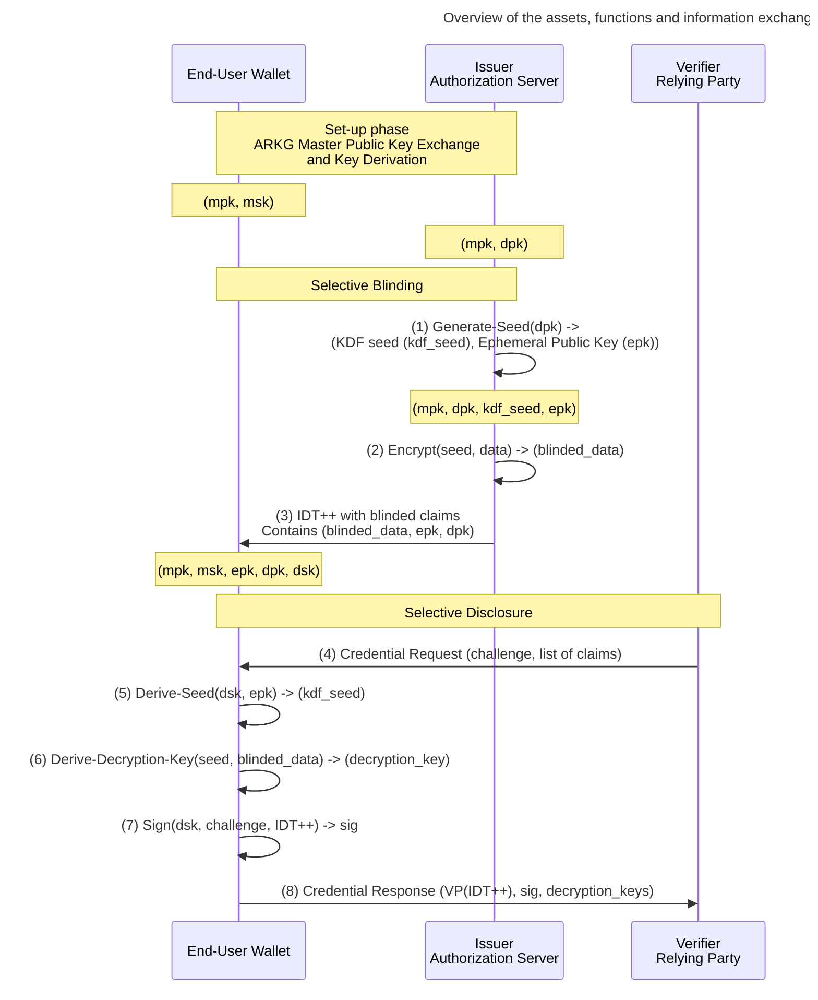

# Selective Disclosure goes Dancing - SD-Cha-Cha <!-- omit in toc -->

- [Introduction to SD-Cha-Cha](#introduction-to-sd-cha-cha)
- [SD-Cha-Cha Overview](#sd-cha-cha-overview)
- [Representation of SD-Cha-Cha Parameters in JWT](#representation-of-sd-cha-cha-parameters-in-jwt)
  - [`sdp`: Selective Disclosure Parameters and Ephemeral Public Key](#sdp-selective-disclosure-parameters-and-ephemeral-public-key)
- [Generate a KDF Seed](#generate-a-kdf-seed)
- [UTF-8 Encode the Claim or Array Element](#utf-8-encode-the-claim-or-array-element)
- [Encrypt](#encrypt)
- [Representation of Blinded Claims and Array Elements in a JWT](#representation-of-blinded-claims-and-array-elements-in-a-jwt)
- [Derive a KDF Seed](#derive-a-kdf-seed)
- [Derive Decryption Key](#derive-decryption-key)
- [Decrypt the Encrypted Data](#decrypt-the-encrypted-data)
- [Security considerations](#security-considerations)
- [Privacy considerations](#privacy-considerations)

## Introduction to SD-Cha-Cha

Selective disclosure is a property where a credential presenter can disclose only a subset of claims. There are many ways to implement selective disclosure [ETSI TR 119 476](https://www.etsi.org/deliver/etsi_tr/119400_119499/119476/01.01.01_60/tr_119476v010101p.pdf). When credentials are fetched in-time, just before presenting them to a Verifier, selective disclosure can be executed by only requesting claims requested by the Verifier. This is also how ID Tokens work today. When credentials cannot be tailored made for known audience, we need other mechanisms to blind and unblind claims in a credential. One common approach that does not require advanced cryptography is using salted hash tables. The approach transforms a credential into a salted hash table by replacing the values we want to blind with their respective salted hash. Salt and the value are shared outside of the (protected) payload. Since JWT is a profile for compact-serialised JWS signatures and the compact format have doesn't support for unprotected headers, a new format must be introduced, which makes the existing OIDC Authorization Servers unusable for issuing such credentials.

We are introducing encryption-based selective disclosure named SD-Cha-Cha that uses encryption for blinding the claims and can be used with the existing JWTs, ID Tokens, and other JSON formats.

The main goal is to hide the claim values, not the structure nor the claim names.

## SD-Cha-Cha Overview

SD-Cha-Cha is designed to blind claims and array elements while without affecting the data structure. Blinding the data structure or claim names are out of scope for SD-Cha-Cha. The following example illustrates the application of SD-Cha-Cha to claims and array elements.

JSON object with claims:

```jsonc
{
  "user": {
    "name": "Alice",
    "email": "alice@example.com",  // This claim is intended to be hidden
    "preferences": {
      "theme": "dark",
      "notifications": "enabled"
    }
  },
  "session": {
    "id": "session-123",
    "tokens": {
      "access": "visible-token",
      "refresh": "hidden-token"  // This claim is intended to be hidden
    }
  },
  "data": ["Visible Item", "Hidden Item", "Visible Again"]
}
```

Below you can find the same JSON object with hidden claims. For demonstration purposes we are showing functions `HIDE-CLAIM()`, however, the values should be replaced with function's output.

```jsonc
{
  "user": {
    "name": "Alice",
    "email": "",  // This claim is hidden
    "preferences": {
      "theme": "dark",
      "notifications": "enabled"
    }
  },
  "session": {
    "id": "session-123",
    "tokens": {
      "access": "visible-token",
      "refresh": ""  // This claim is hidden
    }
  },
  "data": ["Visible Item", "", "Visible Again"], // second element is hidden
  "sdp": {
    "bc": { // a map of blinded claims
        "/user/email": "KgiBn9W6vOn48ijAvQ6ZtP3t0BZiZaqmTSCpIu39",
        "/session/tokens/refresh/": "VhRHqbMg4wWsayUD54uG6kvcBHtauWRmu5h2VffAmlRX",
        "/data/1": "Auu564wgfcGfqBkVms2R4hRa5XtvWhUbyVRWDumHaHMl"
    }
  }
}
```

SD-Cha-Cha consists of the following cryptographic artefacts

| Cryptographic Artefacts   |      Short       |      Wallet      |  Issuer   |     Verifier     |
| ------------------------- | :--------------: | :--------------: | :-------: | :--------------: |
| Derived Public Key        |       dpk        | Shared by Issuer | Generated |                  |
| Derived Secret Key        |       dsk        |    Generated     |           |                  |
| Ephemeral Public Key      |       epk        | Shared by Issuer | Generated |                  |
| Ephemeral Secret Key      |       esk        |                  | Generated |                  |
| KDF Seed                  |     kdf_seed     |     Derived      |  Derived  |                  |
| Encryption/Decryption key | enc_key, dec_key |     Derived      |           | Shared by Wallet |
| Encrypted data            |  encrypted_data  | Shared by Issuer | Generated | Shared by Wallet |

SD-Cha-Cha also defines four cryptographic functions

`GENERATE-SEED(pk) -> (kdf_seed, epk)`
: A function that generates a seed for a Key Derivation Function (KDF) used to derive data encryption keys. It takes a public key (`pk`) as input and outputs a secret encryption seed (`kdf_seed`) and an ephemeral public key (`epk`).

`DERIVE-SEED(dsk, epk) -> (kdf_seed)`
: A function that derives the seed for the KDF from the derived secret key (`dsk`) and the ephemeral public key (`epk`). It returns the secret encryption seed (`kdf_seed`).

`ENCRYPT(data, kdf_seed) -> encrypted_data`
: A function that derives a data encryption key from the provided secret seed (`kdf_seed`) and encrypts the input data (`data`). The result is the `encrypted_data`.

`DERIVE-DECRYPTION-KEY(encrypted_data, kdf_seed) -> (dec_key)`
: A function that derives the data decryption key (`dec_key`) from the `kdf_seed` and information encoded in the `encrypted_data`. It outputs the decryption key.

`DECRYPT(encrypted_data, dec_key) -> (data)`
: A function that decrypts the `encrypted_data` using the derived decryption key (`dec_key`) and returns the original data (`data`).

When SD-Cha-Cha is used with ARKG, issuer can both add a confirmation claim and also selectively blind the data, without interacting with the wallet. In the diagram we are presenting three phases

- Set-up: a process that consists of the ARKG Master Public Key exchange and key derivation
- Selective Blinding: a process that blinds (encrypts) the selected claims
- Selective Disclosure: a process that unblinds (decrypts) the selected blinded claims



(1) An issuer generates a KDF seed, which is a shared secret computed with ECDH using derived public key and ephemeral secret key as inputs.  
(2) The issuer encrypts the data (claim or array element)  
(3) The issuer shares the blinded IDT++ with the wallet.  
(4) A verifier requests a Credential.  
(5) The Wallet derives the KDF seed, which is a shared secret computed with ECDH using derived secret key and ephemeral public key as inputs.  
(6) The Wallet derives the decryption keys using the KDF.  
(7) The Wallet signs the challenge using the derived secret key.  
(8) The Wallet sends a Credential Response to the Verifier.  

## Representation of SD-Cha-Cha Parameters in JWT

We define SD-Cha-Cha for Elliptic Curves. We are using two core cryptographic functions, Elliptic Curve Diffie-Hellman to compute the Key Derivation Function (KDF) seed, and the KDF. We define KDF as

```pseudocode
encryption_key/decryption_key <- HASH(seed || nonce)
```

where `nonce` is the encryption initialization vector and || denotes concatenation of two values. The hash function and the size of the nonce are defined by the SD-Cha-Cha instantiation. See section [Selective Disclosure Parameters](#sdp-selective-disclosure-parameters-and-ephemeral-public-key).


### `sdp`: Selective Disclosure Parameters and Ephemeral Public Key

`sdp` JWT claim is a JSON object that contains information about the selective disclosure algorithm. Parameters for SD-Cha-Cha selective disclosure family are defined in this section.

`sdp` contains the following members:

- **`alg`: Selective Disclosure Algorithm**: REQUIRED. String. Defines the selective disclosure algorithm being used. For SD-Cha-Cha the `alg` value MUST be `sd-cha-cha`. The value is case sensitive. Other specifications MUST define algorithm names for the respective selective disclosure.
If the Selective Disclosure algorithm is not recognized, the credential SHOULD not be processed.
- **`enc`: Encryption Algorithm**: REQUIRED. String. Defines algorithm used for encryption and **MUST** have one of the following values:
  - `XChaCha20` (RECOMMENDED)
  - `ChaCha20`
- **`hash`: Hash Algorithm**: REQUIRED. String. The hash algorithm MUST be a secure hash algorithm recognized in cryptographic standards. The default algorithm is `SHA-256`. The name of the hash algorithm MUST match one of the entries in the [Named Information Hash Algorithm Registry](https://www.iana.org/assignments/named-information/named-information.xhtml).
- **`apu`**: REQUIRED. Base64url encoded string. MUST match the value of the `kid` of the ephemeral key:`/payload/sdp/epk/kid`.
  - Potential optimization: MUST be set to `/protected/jwk/kid`. This option SHOULD be used only if the following two conditions are met:
    - issuer's signing key type matches the user's cnf key type
    - issuer's public key is in the header `jwk` parameter
- **`apv`**: REQUIRED. Base64url encoded string. MUST match the value of to the `kid` of the confirmation method `/payload/cnf/jwk/kid`
- **`epk`**: REQUIRED. JWK. Ephemeral public key as JWK. It MUST have all the required members for the give key type and MUST contain the `kid` member. Supported `crv` values:
  - `P-256` (RECOMMENDED)
  - `P-384`
  - `P-521`

Non-normative example of a Selective Disclosure Parameter claim:

```json
{
  "cnf" {
    "jwk": {
      "kid": "321",
      "kty": "EC",
      "crv": "P-256",
      "x": "rmIeJYdwjy8nzAOcNQnfCcNRdYp6FauGig2IwjRLdbM",
      "y": "o1XwXpdEe_986o6fcvTwQ2dsoUzng-g3Ks7pxFpXq5k"
    }
  },
  "sdp": {
    "alg": "sd-cha-cha",
    "enc": "XChaCha20",
    "hash": "SHA-256",
    "apu": "123",
    "apv": "321",
    "epk": {
      "kid": "123",
      "kty": "EC",
      "crv": "P-256",
      "x": "fs53jLqzuUPKbESq3uQJd58ESN1T76HX4N53PAAGfVY",
      "y": "3k6OA7p_eweg-El18LEIkEgf_M_sOvqEpQyb3V0xHhA"
    }
  }
}
```

## Generate a KDF Seed

KDF seed is a shared secret that can be computed by both the issuer and the holder using the ECDH algorithm. The pseudocode below defines the function for the seed generation.

```pseudocode
GENERATE-SEED(pk) -> (kdfSeed, epk)
  Description:
    Generates a secret seed used to derive encryption/decryption keys.

  Parameters:
    crv: REQUIRED. Elliptic Curve used for key generation.
    HASH: REQUIRED. Hash function.

  Input:
    pk: REQUIRED. Public key.

  Output:
    kdfSeed: Secret encryption seed.
    epk: Ephemeral public key.

  Process:
  (1) [Generate Ephemeral Keypair]
      Generate an ephemeral public (epk)/secret (esk) key pair of the same type as the provided public key.
      
      epk, esk <- GENERATE-KEYPAIR(type_of(pk))

  (2) [Compute Shared Secret]
      Compute the shared secret using Elliptic Curve Diffie-Hellman with esk and pk.
      
      sharedSecret <- EC-DIFFIE-HELLMAN(esk, pk)

      kdfSeed <- sharedSecret

  (3) [Return Values]
      Return the kdfSeed and the ephemeral public key epk.

      RETURN (kdfSeed, epk)
```

The ephemeral public key (epk) MUST be shared with the user as `/sdp/epk` claim. The `kid` value MUST be set to the JWK thumbprint of the `epk`.

## UTF-8 Encode the Claim or Array Element

Before we encrypt the data (JSON claim or a JSON array element), we MUST encode them to UTF-8 string as follows: `UTF8(claim_value)`

UTF8(STRING) denotes the octets of the UTF-8 [RFC3629] representation of STRING.

## Encrypt

Encoded data is encrypted as defined below

```pseudocode
ENCRYPT(kdfSeed, dataToEncrypt) -> (encryptedData)
  Description:
    Encrypts the claims (data).

  Parameters:
    NONCE-SIZE: REQUIRED. Size of the nonce.
      - 24: XChaCha20 (default)
      - 12: ChaCha20
    HASH: REQUIRED. Hash function. Default: SHA256.
    ENCRYPTION_FUNCTION: REQUIRED. Encryption algorithm.
      - XChaCha20 (default)
      - ChaCha20

  Input:
    dataToEncrypt: REQUIRED. Data to be encrypted.
    kdfSeed: REQUIRED. Secret seed used to derive the encryption key.

  Output:
    encryptedData: Base64URL encoded string. Encrypted data.

  Process:
  (1) [Generate Random Nonce]
      nonce <- NEW-NONCE(NONCE-SIZE)

  (2) [Derive Encryption Key]
      encryptionKey <- HASH(kdfSeed || nonce)

  (3) [Encrypt Data]
      encryptedData <- ENCRYPT(encryptionKey, dataToEncrypt)

  (4) [Encode Encrypted Data]
      encryptedData <- BASE64URL.ENCODE(nonce || encryptedData)

  (5) [Return Encrypted Value]
      RETURN encryptedData
```

After the claim is encrypted, it's original value is set to null:

- object: {}
- array: []
- number: null
- string: ""
- boolean: null

## Representation of Blinded Claims and Array Elements in a JWT

Blinded claims are represented as a map, where the key is JSON pointer to the claim in the credential and value is the encrypted value.

## Derive a KDF Seed

KDF seed is a shared secret that can be computed by both the issuer and the holder using the ECDH algorithm. The pseudocode below defines the function for the seed derivation by the wallet.

The ephemeral public key (epk) MUST be taken from the `/sdp/epk` claim. The derived secret key `dsk` is the secret key corresponding to the public key in the `/cnf/jwk` claim.

```pseudocode
DERIVE-SEED(dsk, epk) -> (kdf_seed)
  Description:
    Derives a secret seed used to derive encryption/decryption keys.

  Parameters:
    crv: REQUIRED. Elliptic Curve used for key generation.
    HASH: REQUIRED. Hash function.

  Input:
    dsk: REQUIRED. Derived Secret Key.
    epk: REQUIRED. Ephemeral public key.

  Output:
    kdf_seed: Secret encryption seed.

  Process:
  (1) [Compute Shared Secret]
      Compute the shared secret using Elliptic Curve Diffie-Hellman with dsk and epk.
      
      sharedSecret <- EC-DIFFIE-HELLMAN(dsk, epk)

      kdfSeed <- sharedSecret

  (2) [Return Value]
      Return the kdfSeed.

      RETURN kdfSeed
```

## Derive Decryption Key

```pseudocode
DERIVE-DECRYPTION-KEY(kdfSeed, encryptedData) -> (decryptionKey)
  Description:
    Derives a decryption key from encrypted data and kdf_seed.

  Parameters:
    NONCE-SIZE: REQUIRED. Size of the nonce.
      - 24: XChaCha20 (default)
      - 12: ChaCha20
    HASH: REQUIRED. Hash function. Default: SHA256.

  Input:
    encryptedData: REQUIRED. Base64URL encoded string. Encrypted data.
    kdfSeed: REQUIRED. Secret seed used to initiate the key derivation function.

  Output:
    decryptionKey: Octet string. Derived decryption key.

  Process:
  (1) [Decode Encrypted Data]
      encrypted_data_bytes <- BASE64URL.DECODE(encrypted_data)

  (2) [Extract Nonce]
      nonce <- encrypted_data_bytes[:NONCE-SIZE]

  (3) [Derive Decryption Key]
      decryptionKey <- HASH(kdfSeed || nonce)

  (4) [Return Decryption Key]
      RETURN decryptionKey
```

## Decrypt the Encrypted Data

```pseudocode
DECRYPT(decryptionKey, dataToDecrypt) -> (data)
  Description:
    Decrypts encrypted data using the derived decryption key.

  Parameters:
    NONCE-SIZE: REQUIRED. Size of the nonce.
      - 24: XChaCha20 (default)
      - 12: ChaCha20
    HASH: REQUIRED. Hash function. Default: SHA256.
    DECRYPTION_FUNCTION: REQUIRED. Decryption algorithm.
      - XChaCha20 (default)
      - ChaCha20

  Input:
    dataToDecrypt: REQUIRED. Base64URL encoded string. Encrypted data.
    decryptionKey: REQUIRED. Decryption key.

  Output:
    data: Decrypted data.

  Process:
  (1) [Extract Encrypted Data and Nonce]
      nonce := dataToDecrypt[:NONCE-SIZE]
      encryptedData <- dataToDecrypt[NONCE-SIZE:]

  (2) [Decrypt Data]
      decryptedData <- DECRYPT(decryptionKey, encryptedData)

  (3) [Decode to JSON]
      data <- DECODE-TO-JSON(decryptedData)

  (4) [Return Decrypted Data]
      RETURN data
```

## Security considerations

Nonce MUST be a unique and random value. Nonce size requirements are defined by the respective instantiations.

## Privacy considerations

SD-Cha-Cha does not aim to hide the structure of the JWT Payload.
