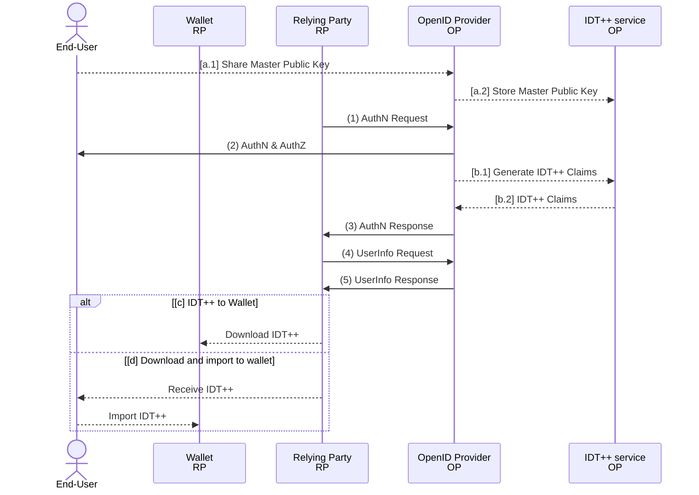

# IDT++ - Extending ID Tokens - Simplifying Issuance of Verifiable Credentials using OpenID Connect

## Introduction

ID Tokens (IDTs), defined as JSON Web Tokens (JWTs) containing claims about authentication events, are widely adopted through the OpenID Connect (OIDC) infrastructure. IDTs have many good properties, such as built-in selective disclosure, option for repudiation and non-repudiation and they don't require revocation. However, since IDTs are typically restricted to a specific audience and have short lifetimes, they are not well-suited for sharing with third parties, such as through digital wallets.

Verifiable credentials (VCs) are modelled as long-lived tokens that can be shared with third partied through digital wallets - similar to digitally signed documents, but with an ability to cryptographically prove ownership, selectively disclose information, and verify the identity and accreditations of an issuer. Examples of VCs are driver's licence, diploma, student ID, and other credentials.

We are introducing ID Token++ (IDT++), an extended IDT profile designed to be issued through OIDC Authorization Servers and having support for cryptographic binding of IDTs to digital wallets, selective disclosure, and identification of issuers using WebPKI. With the IDT++ profile we can start issuing Verifiable Credentials using the existing OIDC infrastructure. Learn how IDT++ simplifies the issuance process building on technologies like Asynchronous Remote Key Generation (ARKG), SD-Cha-Cha, and WebPKI.

## Overview

IDT++, in abstract, fits into the OpenID Connect (OIDC) protocol flow as depicted in the diagram below. Steps (1)-(5) are the [abstract OIDC protocol steps](https://openid.net/specs/openid-connect-core-1_0.html#Overview) and steps [a-d] are the additional steps that extend the OIDC flow.

**[a]** The End-User shares its master public key with the OpenID Provider (OP). This is a one-time process, similar to (dynamic) client registration. If the user already registered its wallet with the OP, this step can be skipped.  
**(1)** The RP (Client) sends a request to the OpenID Provider.  
**(2)** The OP authenticates the End-User and obtains authorization.  
**[b]** The OP extends the End-User claims set (ID Token) by adding IDT++ claims.  
**(3)** The OP responds with an IDT++ and usually an Access Token.  
**(4)** The RP can send a request with the Access Token to the UserInfo Endpoint.  
**(5)** The UserInfo Endpoint returns Claims about the End-User, including the IDT++ claims.  
**[c]** The user downloads the IDT++ to its wallet same as storing a file.  
**[d]** The user downloads the IDT++ as a file (or receives it via email or other communication channel) and imports it into its Wallet as a file.

Step [a] is a one-time process that occurs upon End-User's wallet registration with the OP. If End-User already registered its wallet with the OP, this step can be skipped. Step [b] is a step that's executed for every IDT++ creation. The IDT++ service can be an external service or integrated into the OP's Authorization Server and only generates and adds additional claims to the IDT. Steps [c-d] showcase different ways of how IDT++ can be stored in the wallet - directly, by fetching them from the RP (as storing files) or importing them manually upon receiving them via email or other communication channel.

Once a wallet is registered with the OP, we can introduce a simple, OAuth-protected [credential server](#credential-server), where the Wallet can easily fetch other user credentials.

## ID Token++

The main change that IDT++ makes to the OIDC to enable End-Users to use the IDTs with their wallet is the extension of the IDT data model. The IDT++ inherits all the claims and security properties of the IDTs. IDT++ introduces four main capabilities:

- Enable users present their claims to verifiers using their digital wallet - see [Public Key Generation Delegation using ARKG](#public-key-generation-delegation-using-asynchronous-remote-key-generation)
- Enable users to selectively disclose their claims - see [SD-Cha-Cha](#sd-cha-cha-overview)
- Enable verifiers to verify the issuer's identity using WebPKI infrastructure - see [Expressing Issuer's Identity using WebPKI](#expressing-issuers-identity-with-webpki)

The following claims extend the [OIDC ID Token data model](https://openid.net/specs/openid-connect-core-1_0.html#IDToken):

- cnf: [Confirmation Claim](https://www.rfc-editor.org/rfc/rfc7800.html#section-3.1)
  > By including a `cnf` (confirmation) claim in a JWT, the issuer of the
   JWT declares that the presenter possesses a particular key and that
   the recipient can cryptographically confirm that the presenter has
   possession of that key.  The value of the `cnf` claim is a JSON
   object and the members of that object identify the proof-of-
   possession key.
  >
  > MUST be the [JWK Confirmation Method](https://www.rfc-editor.org/rfc/rfc7800.html#section-3.2). The JWK MUST contain the required key members for a JWK of that key type, it MUST contain the `kid` member, and MAY contain other JWK members. The JWK MUST be the ARKG-derived public key.  
  >
  > REQUIRED for: Proof of Possession, Selective Disclosure SD-Cha-Cha
- kdk: Key Derivation Key
  > By including a `kdk` (key derivation key) claim in a JWT, the issuer of the JWT declares that it derived the presenter's proof-of-possession key using ARKG and that the `kdk` key MUST be used to derive the corresponding private key.
  >
  > MUST be a JWK. The JWK MUST contain the required key members for a JWK of that key type, it MUST contain the `kid` member, and MAY contain other JWK members.
  >
  > REQUIRED for: Selective Disclosure SD-Cha-Cha
- sdp: Selective Disclosure Parameters
  > `sdp` (selective disclosure parameters) claim in a JWT MUST be present if selective disclosure is used. The value of the claim is a JSON object that contains additional information required for unblinding the claims as defined in section [`sdp`](#sdp-selective-disclosure-parameters-and-ephemeral-public-key).
  >
  > REQUIRED for: Selective Disclosure
- iss_jwk: Signing JWK and a WebPKI certificate
  > By including an `iss_jwk` (issuer JWK) claim in a JWT, the issuer of the JWT declares that it used that JWK to sign the JWT and that the attached X.509 certificate attests the binding between the signing key and the domain name.
  >
  > REQUIRED for: WebPKI issuer ID.

Below we summarise which claims become REQUIRED, if a given capability is used:

| Capability           | Required claims |
| -------------------- | --------------- |
| Proof of Possession  | cnf, kdk        |
| Selective Disclosure | cnf, sdp        |
| WebPKI issuer ID     | iss_jwk         |

Use cases can decide which capabilities they need for their credentials.

You can inspect an example [IDT++ on JWT.io](https://jwt.io/?id_token=eyJhbGciOiJSUzI1NiIsInR5cCI6IkpXVCIsImtpZCI6IjVSNXZlZ2cyMjMycDIweC1hM3c4USJ9.eyJodHRwOi8vY29uc3VsLmludGVybmFsL2ZpcnN0X25hbWUiOiIiLCJodHRwOi8vY29uc3VsLmludGVybmFsL2xhc3RfbmFtZSI6IiIsImh0dHA6Ly9jb25zdWwuaW50ZXJuYWwvZ3JvdXBzIjpbXSwibXluZXh0LmlkLmNyZWRlbnRpYWwiOnsiY25mIjp7ImNydiI6IlAtMjU2Iiwia3R5IjoiRUMiLCJ4IjoibUZic0Q4NWcwS2hRN19CYV9ESXVQcldsNGRmVllRNjdOS2w4U3hPVUxncyIsInkiOiJGNzJ0dlVPU0RvYnptdjVZT2NKYXo1eHJVLWdQQmhyaDRHN18zSERfVUE4In0sImNyZWRlbnRpYWxTdWJqZWN0Ijp7ImlkIjoiMTIzIiwiaXNzdWVyIjoiTmV0aXMgZC5vLm8uIiwibWFzdGVyUGFzc3dvcmQiOiIiLCJudWNsZWFyQ29kZXMiOltdLCJwcm9qZWN0SWQiOiJJRFQrK0RFTU8ifSwia2giOnsiY3J2IjoiUC0yNTYiLCJrdHkiOiJFQyIsIngiOiJoQzFpQk5WYVRhTWlJcE1KMHFpZktPZHRneHFkSFEyMG1BbEdLLXdPU0tFIiwieSI6IjJsaXFVVXR3NVV1MVlVWF9sWjRhYUNWaEVOSUFzQXY4X1MyTVJ6YkNtcWcifSwic2RwIjp7ImFsZyI6InNkLWNoYS1jaGEiLCJhcHUiOiIiLCJhcHYiOiIiLCJiYyI6eyIvY3JlZGVudGlhbFN1YmplY3QvbWFzdGVyUGFzc3dvcmQiOiJwdkk3eVpzemduVHVZUDI4N3dfRHdmNDJ0UmtlZUV4WjVjajVzeVNkIiwiL2NyZWRlbnRpYWxTdWJqZWN0L251Y2xlYXJDb2RlcyI6IkpJN2dDOTBLUllKcFh3eDVMVXZYNnlsSUtMdkpPb2p1S09yQ2phVllEVUZCIn0sImVuYyI6IlhDaGFDaGEyMCIsImVwayI6eyJjcnYiOiJQLTI1NiIsImt0eSI6IkVDIiwieCI6IjZGa1BsbXhiWTlLczJ1RGRMZmxzOHdGLWVCV0hreFF1NF81OGx5cjNoZ2siLCJ5IjoiUXprSVZFQTRUelRUQkxEdlZYa2ZKbDVPbVpQdTM1SkpVQ3FBTDU4azNGYyJ9LCJoYXNoIjoiU0hBLTI1NiJ9fSwiZ2l2ZW5fbmFtZSI6IkFsZW4iLCJmYW1pbHlfbmFtZSI6IkhvcnZhdCIsIm5pY2tuYW1lIjoiYWxlbi5ob3J2YXQubmV0aXMiLCJuYW1lIjoiQWxlbiBIb3J2YXQiLCJwaWN0dXJlIjoiaHR0cHM6Ly9saDMuZ29vZ2xldXNlcmNvbnRlbnQuY29tL2EvQUNnOG9jSVBNMXNyRnpoOTlxSUh6TWhUcWJoWmZWd0hieGNxMENGeHlwbWoxN19JR1NsVndrTG49czk2LWMiLCJ1cGRhdGVkX2F0IjoiMjAyNC0xMS0yMFQxNDowODo1NS40NzJaIiwiaXNzIjoiaHR0cHM6Ly9kZXYtazcxMjNoeXQudXMuYXV0aDAuY29tLyIsImF1ZCI6Ikk5dDZPU1IzbWRFZnBycnNtT0FERFVXYTlHM2FWb1F3IiwiaWF0IjoxNzMyMTExNzM4LCJleHAiOjE3MzIxNDc3MzgsInN1YiI6Imdvb2dsZS1vYXV0aDJ8MTAyMTE3OTkyNTMxMTE1ODIxNTE5Iiwic2lkIjoiNkgtbEd3cjUyVTJJZXZtSnFFVW40OUsyNmZWcGdLY0cifQ.lXpB7AILw6nM7Daq7aOCqQlKJ2OO_dMpKD50jjQ-WaIR2KlFtZjVibfibCiGvFyPDudTsshoGakzaloejJXlGCcUtotO7Z39rOWGEyDakGFCFX8z5Zju1PwylSfMPqu4wI3yPd6cIy6BzjdD9gViNTB16Bk_0OqqQfZV187iu-1DDuSOCKdsHl5s1d9RwNrjoRzsSJd_ktJOgDolkfnE3ye_UsZlU9WUmTG6OYRxidKKNwv3HxwMnPecXkzNGtRhcXDqylXuNOa7kDtDN4gMoY9ScFuCKbp9PrMYRqSJxcDCAfWgXVuy5OVFSFjKWlZyqwgYFWmvhJE11WP96GAuNw)
or you can obtain your IDT++ using the [IDT++ Demo App](https://test-api.mynext.id/idt/v2/).

## Specifications

- [Asynchronous Proof-of-Possession Key Generation](./01_async-pop.md)
- [Selective Disclosure Cha-Cha](./02_sd-cha-cha.md)
- [Issuer identity with WebPKI](./03_sd-cha-cha.md)
- [Appendix](./99_appendix.md)

## Demo

- [MyNextID IDT++ showcase](https://test-api.mynext.id/idt/v2/)

## Reference implementation

- Coming soon.

## License

See the [LICENSE](./LICENSE)

## Acknowledgements

This work is being supported by the world greatest team at Netis.
