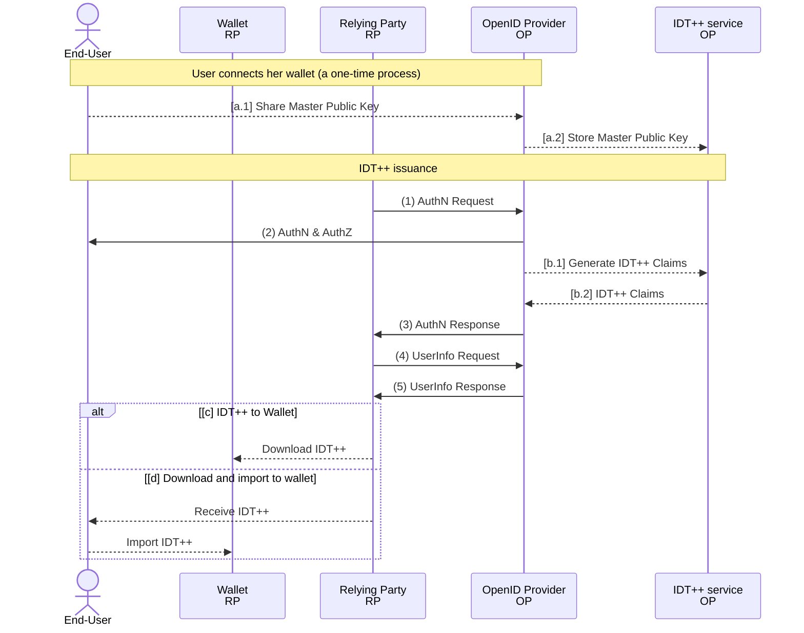

# IDT++ - an ID Token profile with support for cryptographic binding, selective disclosure, and Web PKI <!-- omit in toc -->

Table of Contents

- [Introduction](#introduction)
- [Overview](#overview)
- [ID Token++](#id-token)
- [Specifications](#specifications)
- [Demo](#demo)
- [Reference implementation](#reference-implementation)
- [Extensions](#extensions)
- [Considerations](#considerations)
- [License](#license)
- [Acknowledgements](#acknowledgements)

## Introduction

ID Tokens (IDTs), defined as JSON Web Tokens (JWTs) containing claims about authentication events, are widely adopted through the OpenID Connect (OIDC) infrastructure. IDTs carry many important properties, such as built-in selective disclosure, option for repudiation and non-repudiation and they don't require revocation. However, since IDTs are typically audience-restricted and have short lifetimes, they are not well-suited for sharing with third parties, such as through digital wallets.

Verifiable credentials (VCs) are typically modelled as long-lived tokens that can be shared with third partied through digital wallets - similar to digitally signed documents, but with an ability to cryptographically prove ownership, selectively disclose information, and verify the identity and accreditations of an issuer. Examples of VCs are mobile driver's licence, digital diploma, digital student ID, and other credentials.

We are introducing an IDT profile: ID Token++ (IDT++), a profile designed for IDT so that they can be issued through OIDC Authorization Servers and having support for cryptographic binding to digital wallets, selective disclosure, and identification of issuers using WebPKI. With the IDT++ profile we can start issuing Verifiable Credentials using the existing OIDC infrastructure. Learn how IDT++ simplifies the issuance process building on technologies like Asynchronous Remote Key Generation (ARKG), SD-Cha-Cha, and WebPKI.

## Overview

IDT++ fits into the OpenID Connect (OIDC) protocol flow as depicted in the diagram below. Steps (1)-(5) are the [abstract OIDC protocol steps](https://openid.net/specs/openid-connect-core-1_0.html#Overview) and steps [a-d] are the additional steps that extend the OIDC flow.

**[a]** The End-User shares its master public key with the OpenID Provider (OP). This is a one-time process, similar to (dynamic) client registration. If the user already registered its wallet with the OP, this step can be skipped.  
**(1)** The RP (Client) sends a request to the OpenID Provider.  
**(2)** The OP authenticates the End-User and obtains authorization.  
**[b]** The OP extends the End-User claims set (ID Token) by adding IDT++ claims.  
**(3)** The OP responds with an IDT++ and usually an Access Token.  
**(4)** The RP can send a request with the Access Token to the UserInfo Endpoint.  
**(5)** The UserInfo Endpoint returns Claims about the End-User, including the IDT++ claims.  
**[c]** The user downloads the IDT++ to its wallet same as storing a file.  
**[d]** The user downloads the IDT++ as a file (or receives it via email or other communication channel) and imports it into its Wallet as a file.

Step [a] is a one-time process that occurs upon End-User's wallet registration with the OP. If End-User already registered its wallet with the OP, this step can be skipped. Step [b] is a step that's executed for every IDT++ creation. The IDT++ service can be an external service or integrated into the OP's Authorization Server and only generates and adds additional claims to the IDT. Steps [c-d] showcase different ways of how IDT++ can be stored in the wallet - directly, by fetching them from the RP (as storing files) or importing them manually upon receiving them via email or other communication channel.

## ID Token++

The main change that IDT++ makes to the OIDC to enable End-Users to use the IDTs with their wallet is the extension of the IDT data model with additional claims. IDT++ introduces four main capabilities:

- Enables users store their claims in their digital wallets and to present them to verifiers - see [Asynchronous proof-of-possession key derivation](./01_async-pop.md)
- Enables users to selectively disclose their claims - see [SD-Cha-Cha](./02_sd-cha-cha.md)
- Enables issuers to express their identity using WebPKI - see [Expressing Issuer's Identity using WebPKI](./03_iss-webpki.md)

The following claims extend the [OIDC ID Token data model](https://openid.net/specs/openid-connect-core-1_0.html#IDToken):

- cnf: [Confirmation Claim](https://www.rfc-editor.org/rfc/rfc7800.html#section-3.1)
  > By including a `cnf` (confirmation) claim in a JWT, the issuer of the
   JWT declares that the presenter possesses a particular key and that
   the recipient can cryptographically confirm that the presenter has
   possession of that key.  The value of the `cnf` claim is a JSON
   object and the members of that object identify the proof-of-
   possession key.
  >
  > MUST be the [JWK Confirmation Method](https://www.rfc-editor.org/rfc/rfc7800.html#section-3.2). The JWK MUST contain the required key members for a JWK of that key type, it MUST contain the `kid` member, and MAY contain other JWK members. The JWK MUST be the ARKG-derived public key.  
  >
  > REQUIRED for: Proof of Possession, Selective Disclosure SD-Cha-Cha
- kh: Key Derivation Key
  > By including a `kh` (key derivation key) claim in a JWT, the issuer of the JWT declares that it derived the presenter's proof-of-possession key using ARKG and that the `kh` key MUST be used by the user to derive the corresponding private key.
  >
  > MUST be a JWK. The JWK MUST contain the required key members for a JWK of that key type.
  >
  > REQUIRED for: Proof of Possession, Selective Disclosure SD-Cha-Cha
- sdp: Selective Disclosure Parameters
  > `sdp` (selective disclosure parameters) claim in a JWT MUST be present if selective disclosure is used. The value of the claim is a JSON object that contains SD parameters and blinded claims.
  >
  > REQUIRED for: Selective Disclosure SD-Cha-Cha
- iss_jwk: Issuer identity
  > By including an `iss_jwk` claim in a JWT, the issuer of the JWT presents additional identity information about itself. WebPKI profile is defined in this document.
  >
  > REQUIRED for: WebPKI issuer ID.

Below we summarise which claims become REQUIRED, if a given capability is used:

| Capability           | Required claims |
| -------------------- | --------------- |
| Proof of Possession  | cnf, kh        |
| Selective Disclosure | cnf, kh, sdp   |
| WebPKI issuer ID     | iss_jwk         |

The capabilities can be used independently, hence use cases can decide which capabilities they use.

You can inspect an example [IDT++ on JWT.io](https://jwt.io/?id_token=eyJhbGciOiJSUzI1NiIsInR5cCI6IkpXVCIsImtpZCI6IjVSNXZlZ2cyMjMycDIweC1hM3c4USJ9.eyJodHRwOi8vY29uc3VsLmludGVybmFsL2ZpcnN0X25hbWUiOiIiLCJodHRwOi8vY29uc3VsLmludGVybmFsL2xhc3RfbmFtZSI6IiIsImh0dHA6Ly9jb25zdWwuaW50ZXJuYWwvZ3JvdXBzIjpbXSwibXluZXh0LmlkLmNyZWRlbnRpYWwiOnsiY25mIjp7Imp3ayI6eyJjcnYiOiJQLTI1NiIsImtleV9vcHMiOlsidmVyaWZ5Il0sImtpZCI6ImoxZ2k2RG1oT3lSbV90cUZ3UDBJeGxXUFZtY2lhTTd4Q1F3RVZGRmNsRVE9Iiwia3R5IjoiRUMiLCJ4IjoibFhia3JpRWtMdnhsM1k0VXo1NU94T2NRNmk4Uk5Idmh2Mk90aEtPWVJnNCIsInkiOiJjNjRLTzJVYktLSFA1QktNY2E5WWRSMV9xeW05a2Fyamw0dUpUOUZxZEM0In19LCJjcmVkZW50aWFsU3ViamVjdCI6eyJpZCI6IjEyMyIsImlzc3VlciI6Ik5ldGlzIGQuby5vLiIsIm1hc3RlclBhc3N3b3JkIjoiIiwibnVjbGVhckNvZGVzIjpbXSwicHJvamVjdElkIjoiSURUKytERU1PIn0sImtoIjp7ImFsZyI6IkFSS0ctUDI1NkFERC1FQ0RIIiwiY3J2IjoiUC0yNTYiLCJraWQiOiJPLS1KTml4aVlEUUR2ZmNQSHgwTGIxRUtCYVE4S3JOQ1BIa3owY3VLMng4PSIsImt0eSI6IkVDIiwieCI6InNDeXJfNTczSjV4YTZfLUcya2dIVDRlQ29YUGJoQ2Jyd1Z5dkhJaU5HU3ciLCJ5IjoiN2ZiY0QxM0RDUXFxNVdpSlN4STBidjd0QkRPXzc2T2NscmNHRHotSEFqQSJ9LCJzZHAiOnsiYWxnIjoic2QtY2hhLWNoYSIsImFwdSI6ImxNVEczTmVZdGdPYkFIWVlEZ0g1UkN2RUljQmRWR0xMdUtWMmRXRm1kejQ9IiwiYXB2IjoiajFnaTZEbWhPeVJtX3RxRndQMEl4bFdQVm1jaWFNN3hDUXdFVkZGY2xFUT0iLCJiYyI6eyIvY3JlZGVudGlhbFN1YmplY3QvbWFzdGVyUGFzc3dvcmQiOiJzcWZPVm85QmJJQWE3U3d0Y25QaFg2bDdodEFjS1VybUJRNllVN2RhIiwiL2NyZWRlbnRpYWxTdWJqZWN0L251Y2xlYXJDb2RlcyI6IldmU08xTTFUalYxVVZXRnZ3em1ZYTVYMDQycWdPelBpc0tWYi1RQkpncHQ1In0sImVuYyI6IlhDaGFDaGEyMCIsImVwayI6eyJjcnYiOiJQLTI1NiIsImtpZCI6ImxNVEczTmVZdGdPYkFIWVlEZ0g1UkN2RUljQmRWR0xMdUtWMmRXRm1kejQ9Iiwia3R5IjoiRUMiLCJ4IjoibFpCdmxOUVpWeEpubnppZE9iekVBVElPbFhTcTZGdkVkSHN1SzFFWlRObyIsInkiOiJtXzlOSDFKWE1LV2NYNFI0blVFSnRqYkhEUWV1bXVPTlhQeThDUUwtMWY0In0sImhhc2giOiJTSEEtMjU2In19LCJnaXZlbl9uYW1lIjoiQWxlbiIsImZhbWlseV9uYW1lIjoiSG9ydmF0Iiwibmlja25hbWUiOiJhbGVuLmhvcnZhdC5uZXRpcyIsIm5hbWUiOiJBbGVuIEhvcnZhdCIsInBpY3R1cmUiOiJodHRwczovL2xoMy5nb29nbGV1c2VyY29udGVudC5jb20vYS9BQ2c4b2NJUE0xc3JGemg5OXFJSHpNaFRxYmhaZlZ3SGJ4Y3EwQ0Z4eXBtajE3X0lHU2xWd2tMbj1zOTYtYyIsInVwZGF0ZWRfYXQiOiIyMDI0LTEyLTA0VDEyOjIyOjM4LjU1N1oiLCJpc3MiOiJodHRwczovL2Rldi1rNzEyM2h5dC51cy5hdXRoMC5jb20vIiwiYXVkIjoiSTl0Nk9TUjNtZEVmcHJyc21PQUREVVdhOUczYVZvUXciLCJpYXQiOjE3MzM3NTY2NTksImV4cCI6MTczMzc5MjY1OSwic3ViIjoiZ29vZ2xlLW9hdXRoMnwxMDIxMTc5OTI1MzExMTU4MjE1MTkiLCJzaWQiOiI5cjEyN0loX19ONldkdWJFa3RSRHFmZkJQSXVvSVg0NyJ9.SrMUNdIlBT34WtH_JDU2MSck6YuhbJWLJjf5Gdne1NXWF72d9oqosFHryI0A9ehenWkJjROKy4EQOlGCo0L5Ypdqk7YJC0P2lBIMrk97HWaMGPxh-Rrt2KZrM1V-7MFERT7pa8lU3hwPZtOaclyL-7TzBD3FC70dSGOwrW_H1Ohvli5UIu5IZCxfKEn8PddPVdtUeZdudi7Fj2OpEmXSabGmbEMwWjrKO54jTh0ZjR9TLwPSPS0U3IJiFq1zRIimlP1k3VU5Yj5SOqfe8TFPEfXsQEz1AezYRa-csXsHd4ZcmJPt53rVBcm3SJGBq0lv9WIj8BXDq0trvn45fXpdng)
or you can obtain your IDT++ using the [IDT++ Demo App](https://test-api.mynext.id/idt/v2/).

## Specifications

In the documents below you can find details about the different capabilities.

- [Asynchronous Proof-of-Possession Key Generation](./01_async-pop.md)
- [Selective Disclosure Cha-Cha](./02_sd-cha-cha.md)
- [Issuer identity with WebPKI](./03_iss-webpki.md)
- [Extension: IDT++ Server](./04_idtpp-server.md)
- [Appendix](./99_appendix.md)

## Demo

- [MyNextID IDT++ showcase](https://test-api.mynext.id/idt/v2/)

## Reference implementation

- Coming soon.

## Extensions

- Extension for PQC algorithm
- Extension for BSS+ or other selective disclosures

## Considerations

The design is not limited to JWT signature profile and can be applied to other credential and signature formats, such as mdoc, W3C Verifiable Credentials, JAdES, and others.

## License

See the [LICENSE](./LICENSE)

## Acknowledgements

This work is being supported by the world greatest team at Netis. Existing work that inspired this specification

- [Blockchain Privacy-Enhancing Technology Series — Stealth Address (I)](https://hackernoon.com/blockchain-privacy-enhancing-technology-series-stealth-address-i-c8a3eb4e4e43)
- [ARKG (IETF Draft)](https://www.ietf.org/archive/id/draft-bradleylundberg-cfrg-arkg-02.html)
- [PIKA (IETF Draft)](https://www.ietf.org/archive/id/draft-barnes-oauth-pika-01.html)
- [SD-JWT (IETF Draft)](https://www.ietf.org/archive/id/draft-ietf-oauth-selective-disclosure-jwt-14.html)
- [OID4VCI (OpenID Draft)](https://openid.net/specs/openid-4-verifiable-credential-issuance-1_0.html)

The authors would like to thank all of these authors for their research and work that led to the creation of this specification.
